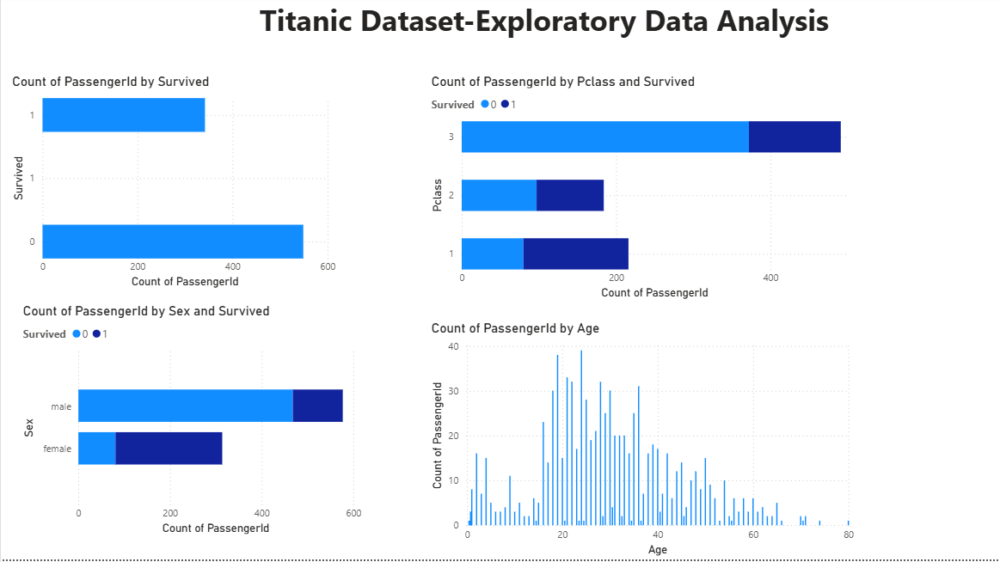

# SCT_DS_2 - Titanic Exploratory Data Analysis
- **Track:** Data Science
- **Task:** Task 2

## Objective
Perform data cleaning and exploratory data analysis (EDA) 
on the Titanic dataset from Kaggle. Explore relationships 
between variables and identify patterns and trends in the data.

## Tool Used
Microsoft Power BI

## Dataset
- **Source:** Kaggle — Titanic Dataset
- **File Used:** train.csv
- **Total Rows:** 891 passengers
- **Columns:** PassengerId, Survived, Pclass, Name, Sex, 
  Age, SibSp, Parch, Ticket, Fare, Cabin, Embarked

## Data Cleaning Steps
- Removed Cabin column (too many missing values)
- Removed Name and Ticket columns (not needed for analysis)
- Filled missing Age values

## Charts Created
1. Survival Count — Total survived vs not survived
2. Survival by Gender — Male vs Female survival rate
3. Survival by Passenger Class — Class 1, 2, 3 comparison
4. Age Distribution — Age spread of all passengers

## Key Insights
- Only 342 out of 891 passengers survived (38%)
- Females had much higher survival rate than males
- 1st class passengers survived more than 2nd and 3rd class
- Most passengers were between age 20 to 40 years old
- Children had higher survival rate than adults

## Dashboard Screenshot

